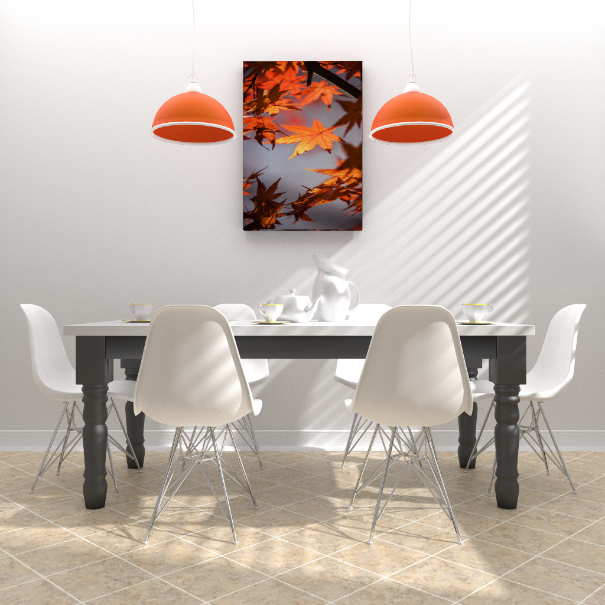
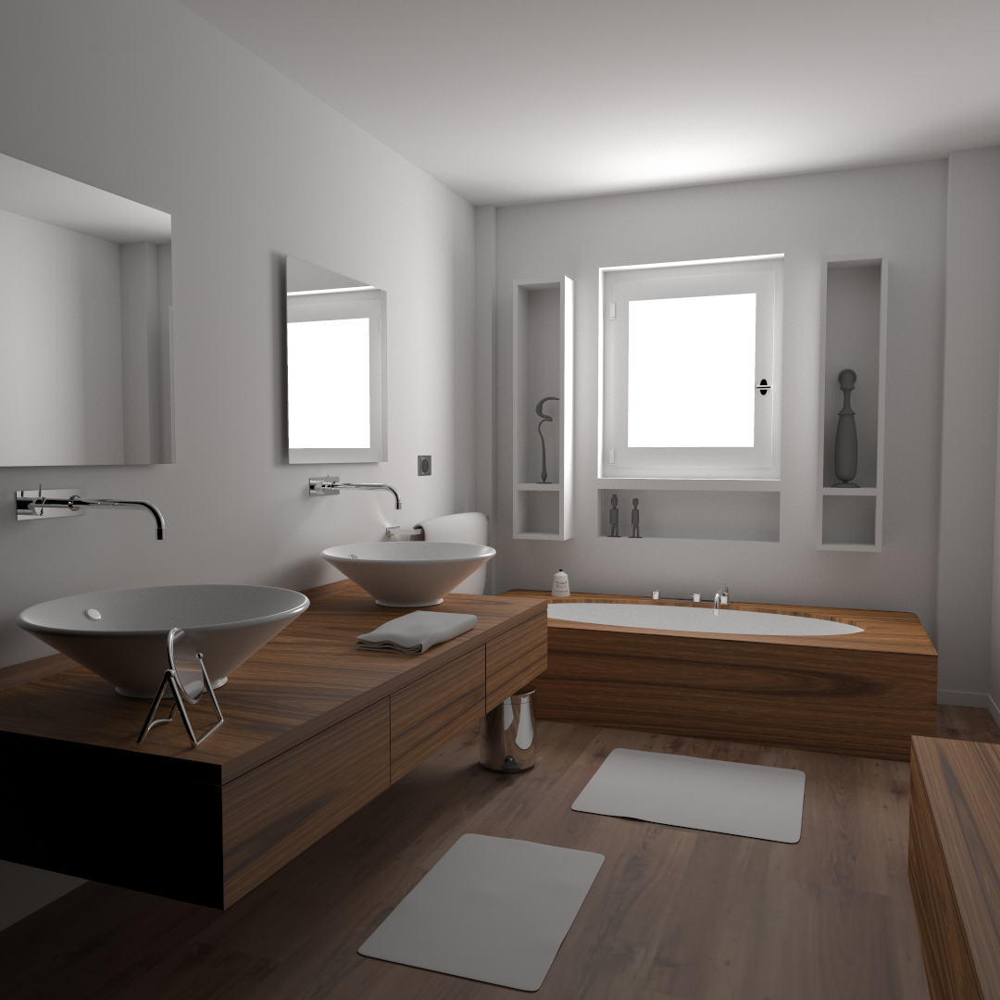
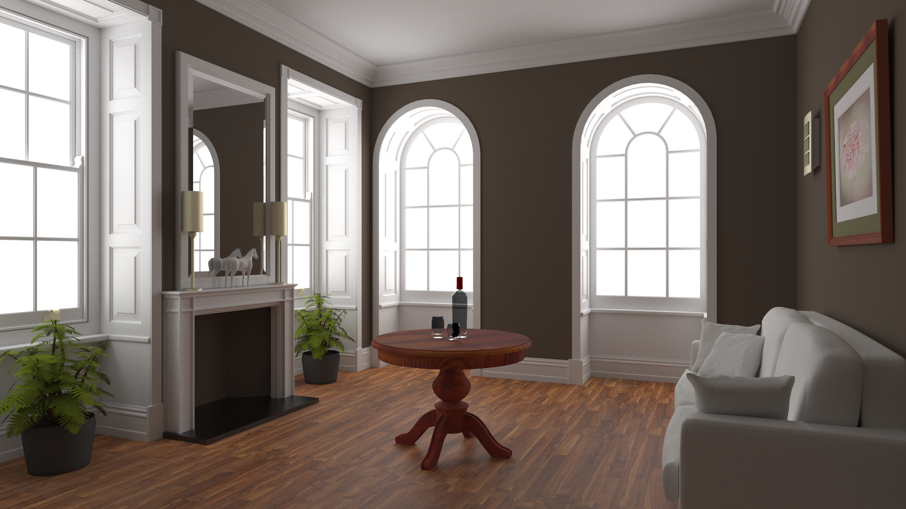
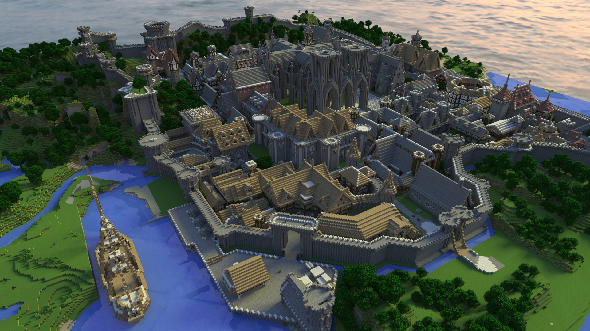
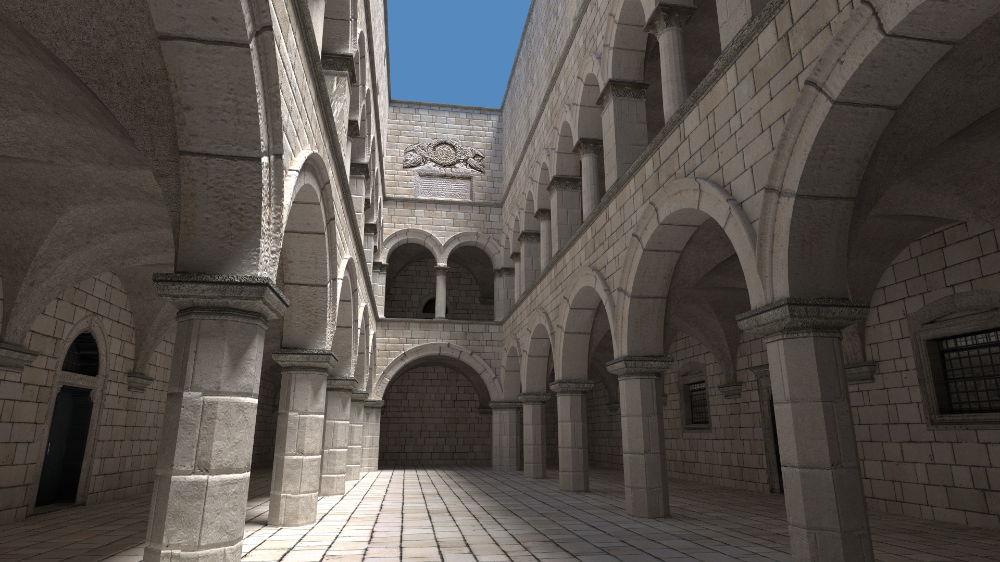

# TinyPT

A tiny path tracer accelerated by OpenMP & CUDA.



## Features

* [x] Global illumination rendering with path tracing.
* [x] Parallel rendering with OpenMP (on CPU) and CUDA (on nvidia GPU).
* [x] Complex triangle mesh model from Wavefront OBJ with MTL texture, accelerated by BVH.
* [x] Lambertian, metal, dielectric, and glossy (Cook-Torrance GGX) BxDFs.
* [x] Alpha texture mapping, and bump texture with height map.
* [x] Area light, point light, distant light, and environmental lighting.

## Getting Started

**Basic Usage**

Firstly, clone the repo recursively to your local environment.

```sh
git clone --recursive https://github.com/li-plus/tinypt.git && cd tinypt
# or
git clone https://github.com/li-plus/tinypt.git && cd tinypt && git submodule update --init
```

Install compilation dependencies and download necessary scene resources.

```sh
sudo apt install gcc g++ cmake make libeigen3-dev libopencv-dev libgflags-dev libgoogle-glog-dev python3-dev python3-pip
bash resource/get_resource.sh
```

Build the project.

```sh
cmake -B build .
cmake --build build -j
```

Render an example scene with two spheres in a box, which is taken from [smallpt](https://www.kevinbeason.com/smallpt/).

```sh
./bin/pt -device cuda -num_samples 1000 -save_path scene.png -scene cornell_sphere
```

**Python API**

Python binding is also available for TinyPT. To build and install the Python package for development, run:

```sh
cd python/
python3 setup.py develop
```

Run a Python example.

```sh
python3 examples/main.py --device cuda --num-samples 1000 --save-path scene.png --scene cornell_sphere
```

To build the wheel for distribution, run:

```sh
python3 setup.py bdist_wheel
```

**Docker**

For those who do not have root privilege, we offer an alternative to build & run TinyPT within a docker container. For GPU support, [nvidia-docker](https://github.com/NVIDIA/nvidia-docker) should be further installed.

```sh
cd docker
docker build . -t tinypt:latest --build-arg CUDA=1
bash run.sh tinypt:latest
```

## More Examples

Following scenes are credited to [smallpt](https://www.kevinbeason.com/smallpt/) and [McGuire Computer Graphics Archive](https://casual-effects.com/data/).


|          |  |
| ------------------------------------------------ | -------------------------------------------- |
|    |            |
|  |      |

## References

+ smallpt [[code]](https://www.kevinbeason.com/smallpt/)
+ scratchapixel [[blog]](https://www.scratchapixel.com/index.php)
+ Ray Tracing in One Weekend [[book]](https://raytracing.github.io/) [[code]](https://github.com/RayTracing/raytracing.github.io)
+ Physically Based Rendering:From Theory To Implementation [[book]](https://www.pbr-book.org/) [[code]](https://github.com/mmp/pbrt-v3)
+ minpt [[code]](https://github.com/hi2p-perim/minpt)

